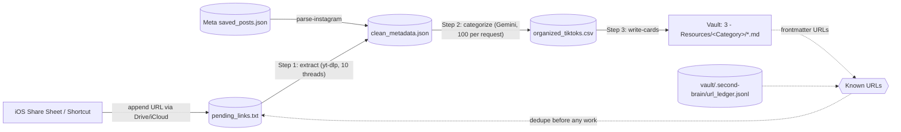

# obsidian-second-brain-pipeline

> Independent project; not affiliated with or endorsed by Obsidian.

Turn the short-form videos you save on TikTok and Instagram into small, actionable Markdown cards in an [Obsidian](https://obsidian.md) vault organized with P.A.R.A.

You capture on the phone (the iOS Share Sheet appends a URL to a synced text file). Later, one click on the desktop pulls metadata with `yt-dlp`, has Gemini sort about 100 videos per request into 13 categories, and writes one card per video into `3 - Resources/<Category>/`. From there you triage cards with Dataview hubs, Kanban boards, and so on.

This repo holds the pipeline code and templates only. Your vault, queue files, Instagram export, and API key stay local and are gitignored.

## Architecture



```
[iOS Share Sheet] --append URL--> pending_links.txt
  Step 1   second-brain extract          yt-dlp metadata        -> clean_metadata.json
  Step 1b  second-brain parse-instagram  Meta export, no yt-dlp -> clean_metadata.json
  Step 2   second-brain categorize       Gemini mega-batches    -> organized_tiktoks.csv
  Step 3   second-brain write-cards      Markdown cards         -> <vault>/3 - Resources/<folder>/
```

### Guarantees

| Concern | How it is handled |
|---|---|
| Gemini free tier (about 20 requests/day, resets at midnight Pacific) | 100 items per request, compact output schema `{i, cat, summ}`, exponential backoff with jitter on `429`. If the error names a per-day quota, the run stops without retrying. |
| No duplicate work | Before extraction, a URL is skipped if it is in any card's frontmatter (the vault is the registry), in the ledger, or already waiting in a queue file. URLs are normalized first: tracking parameters such as `igsh`, `utm_*`, `is_from_webapp`, and `sender_device` are removed, so the same video shared twice counts once. |
| Deleted and tossed cards stay gone | `<vault>/.second-brain/url_ledger.jsonl` records every URL that became a card. Deleting a card does not make its URL "new" again. |
| Crash safety | Queues are "pop on success": each item or batch is removed only after its output is written and `fsync`ed. Every rewrite is atomic (temp file, fsync, rename). A crash at any point can repeat at most the in-flight item, and dedupe then skips it. |
| Zero waste | Intermediate queues (`clean_metadata.json`, `organized_tiktoks.csv`) are deleted when empty. `pending_links.txt` is cleared in place instead, so Google Drive / iCloud Shortcut targets stay linked. |

## Repository layout

```
LICENSE                       MIT
run_pipeline.bat              One-click Windows entry point (steps 1-3)
config.example.yaml           Copy to config.yaml (gitignored)
.env.example                  Copy to .env (gitignored) for GEMINI_API_KEY
src/second_brain/
  cli.py                      `second-brain <command>` / `python -m second_brain`
  config.py                   config.yaml loading and validation
  steps/extract_metadata.py   Step 1   (was 1_extract_metadata.py)
  steps/parse_instagram.py    Step 1b  (was 1_parse_instagram_json.py)
  steps/categorize.py         Step 2   (was 2_categorize_mega_batch.py)
  steps/write_cards.py        Step 3   (was 3_csv_to_obsidian.py)
  steps/registry.py           Known-URL check shared by all steps
  vault.py  ledger.py         Frontmatter scan, card writing, URL ledger
  gemini.py io_utils.py       Backoff and atomic/fsynced file helpers
  taxonomy.py                 Category -> folder map
  model_a/                    Experimental deep-analysis track (see below)
examples/sample-vault/        Fake vault: a few cards, a Comedy Hub, a Kanban board
tests/                        pytest suite (Gemini is mocked, no network)
```

## Setup (Windows)

Prerequisites: Python 3.10+ ([python.org](https://www.python.org/downloads/windows/); tick "Add python.exe to PATH") and Obsidian with the Dataview plugin.

```powershell
git clone <this repo> obsidian-second-brain-pipeline
cd obsidian-second-brain-pipeline
python -m venv .venv
.\.venv\Scripts\Activate.ps1          # if blocked: Set-ExecutionPolicy -Scope CurrentUser RemoteSigned
pip install -e .                      # also installs yt-dlp
copy config.example.yaml config.yaml
copy .env.example .env
notepad config.yaml                   # set vault_path and pending_links_path
notepad .env                          # paste your Gemini key
```

The distribution is named `obsidian-second-brain-pipeline`. The command it installs is `second-brain`, and the Python package it imports is `second_brain`.

Get a free Gemini API key from [Google AI Studio](https://aistudio.google.com/apikey). The key is read from `GEMINI_API_KEY` (or `GOOGLE_API_KEY`), either as a real environment variable or from `.env`. Never put it in `config.yaml`.

PowerShell 5.1 has no `&&`. Chain commands with `;` plus `if ($?) { ... }`, or use `run_pipeline.bat`.

## Configuration

Everything machine-specific lives in `config.yaml`. See `config.example.yaml` for the full list with comments. The important keys:

| Key | Meaning |
|---|---|
| `vault_path` | Vault root, the folder containing `3 - Resources`. On Windows use forward slashes: `D:/Obsidian/The Brain`. |
| `pending_links_path` | The file your iOS Shortcut appends to, for example `G:/My Drive/Inbox/pending_links.txt`. |
| `data_dir` | Where `clean_metadata.json` and `organized_tiktoks.csv` live (default `./data`, gitignored). |
| `ledger_path` | Persistent URL ledger. Default: `<vault_path>/.second-brain/url_ledger.jsonl`, a hidden folder that Obsidian does not index, so the ledger syncs and backs up along with the vault. |
| `gemini.*` | Model, batch size (100), retries, backoff base (8s), jitter, and pause between batches. |
| `taxonomy` | Optional replacement for the default category-to-folder map. |

Relative paths are resolved from the folder that contains `config.yaml`. Use `--config PATH` or `SECOND_BRAIN_CONFIG` to point somewhere else.

## Running

One click: double-click `run_pipeline.bat` (or pin a shortcut to the taskbar). It activates `.venv` if present, runs steps 1 to 3, and stops at the first real error.

Or run commands individually:

```powershell
second-brain extract            # Step 1
second-brain categorize         # Step 2 (uses Gemini)
second-brain write-cards        # Step 3
second-brain run                # 1 -> 2 -> 3
second-brain parse-instagram    # one-off: import a Meta "saved items" export instead of Step 1
second-brain ledger-sync        # record vault URLs + tossed cards in the ledger
second-brain -v <command>       # debug logging
```

Example output:

```
23:18:52 INFO    Scanning Obsidian vault for existing cards...
23:18:52 INFO    Skipped 3 URL(s) already in The Brain, the ledger, or the queue.
23:18:53 INFO    Found 240 video(s) to categorize (~3 request(s)).
23:18:53 INFO    Generated 240 new card(s) in The Brain (0 already known).
23:18:53 INFO    CLEANUP: All cards generated. 'organized_tiktoks.csv' deleted.
```

Exit codes: `0` means done, including a Gemini run that stopped early with its queue intact (Step 3 still writes whatever was categorized). `2` means a config or setup problem. `1` means an unexpected error.

### Triage and deleting cards

Cards are created with `status: "inbox"`. Set `status` to `kept`, `promoted`, or `tossed` as you triage. Every card the pipeline writes is recorded in the ledger. For cards that existed before you started using the ledger, run `second-brain ledger-sync` once before deleting anything. Step 1 also runs this sync automatically on each run.

### Try it with the sample vault

`config.example.yaml` points at `examples/sample-vault/The Brain`, so you can open that folder in Obsidian to see the card format, the `Comedy Hub.md` Dataview table, and the Movies Kanban board.

## Model A (experimental)

`model_a/` holds a deeper-analysis track, which is not part of the `.bat` file:

- `second-brain model-a-ingest` reads the vault's `3 - Resources/Inbox/pending_links.txt` and analyzes one URL at a time. It works in tiers: metadata first; if the caption is sparse, an audio transcript; if that is empty too, two keyframes. It routes videos into Tech & Coding, Project Ideas, or Movies & Shows, and sends low-confidence ones to `Inbox/Manual Review`. This costs 1 to 3 Gemini requests per URL, so it does not fit the free tier for bulk use. The keyframe tier needs `pip install -e .[model-a]`.
- `second-brain model-a-enrich` re-classifies existing cards in those folders, 10 per request. It adds criteria tags (genre, tool, project time), renames files, and adds movies to `!Watchlist Kanban.md`. Your notes section and triage status are preserved.

## Development

```powershell
pip install -e .[dev]
pytest
```

The tests cover frontmatter dedupe, queue pop-on-success and crash recovery, the ledger, 429 backoff, 100-item Gemini response parsing (with a mocked client), Instagram parsing, config validation, and a guard that fails if a hardcoded Windows user-profile path or a Google API key appears in the repo.

## Security and privacy

- Secrets: the Gemini key comes only from the environment or a gitignored `.env`. In a managed environment, inject `GEMINI_API_KEY` from a secret store (for example Azure Key Vault) instead of using `.env`.
- Personal data: the vault, `pending_links.txt`, queue files, the ledger, `saved_posts.json`, and browser cookies are all gitignored. `cookies_from_browser` only names a browser. yt-dlp reads the cookies at runtime, and they are never written to disk by this tool.
- Untrusted input: lines in `pending_links.txt` must be http(s) URLs. They are passed to yt-dlp as a list (no shell) after `--`, so they cannot inject options. Model output is never used as a path: unknown categories go to `Inbox`, and titles are sanitized for Windows file names.

## Known limitations

- Only one copy of the pipeline should run at a time. There is no lock file.
- TikTok short links (`vm.tiktok.com/...`) are not resolved to the canonical video URL, so a short link and a full link to the same video count as two URLs.
- Tags such as `category/movies-&-shows` are kept for compatibility with existing vaults, even though Obsidian does not treat `&` as a valid tag character.

## Roadmap

- TODO: Legacy card migration. Write a one-time, dry-run-first script that:
  - rewrites tag slugs that Obsidian rejects (`category/movies-&-shows`, nested `category/art/organization/spaces`);
  - unifies Model A's `second-brain` tag with `saved-media`;
  - moves Model A's `To Watch` / `manual-review` statuses into a separate field, so `status` stays within `inbox | kept | promoted | tossed`;
  - re-normalizes stored `url:` values.

  Update the Dataview hubs at the same time.
- Hub scaffolding: create a `<Category> Hub.md` with Dataview queries whenever a new category folder appears.
- Mobile capture: finish the iOS Shortcut that writes to a Drive or iCloud `pending_links.txt`.
- Promotion command: one Obsidian action that sets `status: promoted` and moves the card to `1 - Projects/`.

## License

[MIT](LICENSE) © 2026 Scott Plichta. "Obsidian" is a trademark of its owner. It is used here only to describe compatibility.
